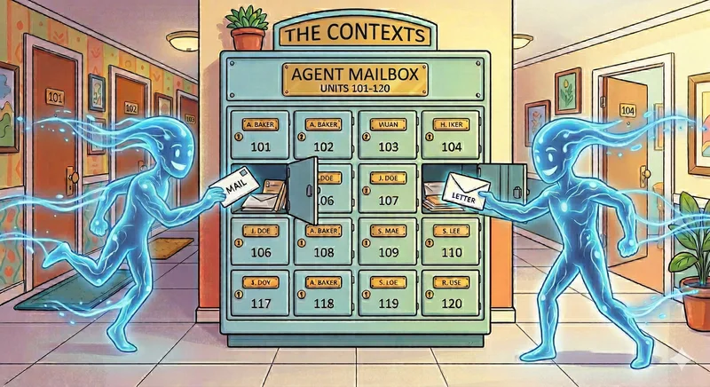

<h1 align="center"><b>agent-mailbox</b></h1>

<p align="center">
  
</p>

Targeted knowledge transfer between agent sessions — so one session doesn't have to rediscover what another already knows.

Each agent session builds deep context as it works: codebase understanding, bug investigations, design decisions, integration discoveries. That context is trapped in the session that earned it. `agent-mailbox` lets a different session tap that knowledge directly instead of re-deriving it from scratch.

## Install

```bash
uv tool install --editable /path/to/agent-mailbox
```

## Setup

Copy the skill into your Claude Code skills directory:

```bash
# System-level (available in all repos)
cp examples/claude/SKILL.md ~/.claude/skills/agent-mailbox/SKILL.md

# Or repo-level (available in one project)
cp examples/claude/SKILL.md .claude/skills/agent-mailbox/SKILL.md
```

For Codex, see `examples/codex/`.

## Further reading

- [`docs/architecture.md`](docs/architecture.md) — event model, filesystem layout, thread lifecycle, TTL behavior
- [`docs/skill-examples.md`](docs/skill-examples.md) — skill authoring patterns for Claude and Codex
- [`examples/`](examples/) — ready-to-use skill and config files

## License

MIT
